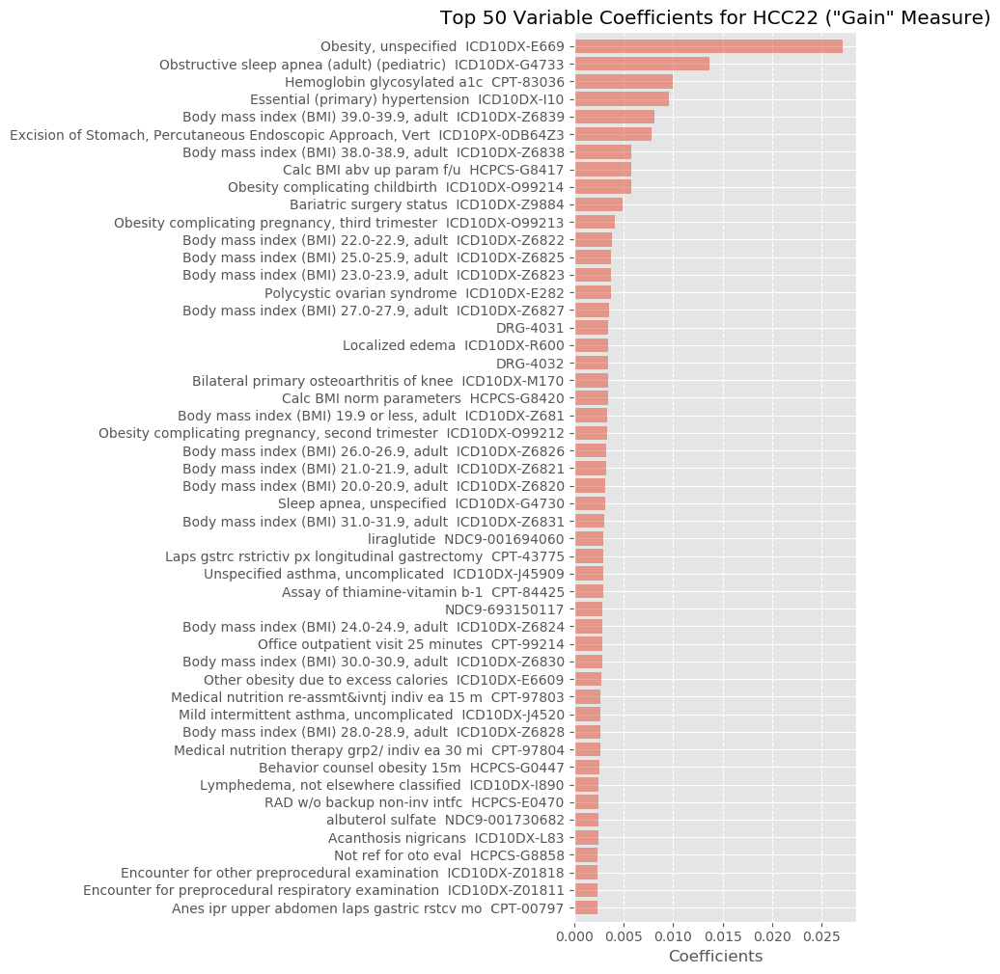
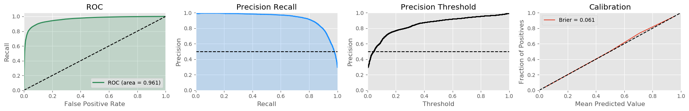

# shakespeare - Machine Learning for Medical Claims Retrospective Risk Adjustment

## Summary

**shakespeare** is a Python package for for detecting the likely conditions of a patient based on medical codes attached to that patient through the use of machine learning for risk adjustment purpose supported by [Inovalon Inc.](https://www.inovalon.com/) The package includes the entire pipelines for training and deploying, along with utilities for fetching data from Inovalon database. The models leverage wide range of medical claims, including all diagnoses and procedures as International Classification of Diseases (ICD) version 9/10 diagnosis/procedures, Current Procedural Terminology (CPT) and Healthcare Common Procedure Coding System (HCPCS), as well as medications as National Drug Code (NDC).

**shakespeare** provides stable Python APIs based on [XGBoost](https://xgboost.readthedocs.io/en/latest/index.html). Keep up to date with version releases and issue reporting by
emailing to
[ywang2@inovalon.com](ywang2@inovalon.com) or [wkinsman@inovalon.com](wkinsman@inovalon.com).

## Installation

Before installing **shakespeare**, please install XGBoost first (highly recommend version 0.72) to avoid potential compile problems. Follow the [installation instruction](https://xgboost.readthedocs.io/en/latest/build.html) of offical guildline.

To download built **shakespeare** wheel files:

| Build Type      | Status | Artifacts |
| ---             | ---    | ---       |
| **Linux**   | []() | [Py3 wheel](https://www.inovalon.com/) |
| **Windows** | []() | [Py3 wheel](https://www.inovalon.com/) |

Please

To install on Linux machine:

```
$ pip install shakespeare-2.5.0-py3-manylinux1_x86_64.whl
```

To install on Windows machine:

```
$ pip install shakespeare-2.5.0-py3-win_amd64.whl
```

Or install from source

```
$ python setup.py install
```

## API Documentation

### 1. deploy

```python
shakespeare.detect(payer,server,memberID_list=None,date_start=None,date_end=None,file_date_lmt=None,
                   mem_date_start=None,mem_date_end=None,model=63,auto_update=False,threshold=0,
                   output_path=None,get_indicators=False,top_n_indicator=5):
```

```deploy``` main functions detects the HCCs patients may have, and supporting evidence, given a batch of patient's info.

##### Parameters
* ```payer``` : str. Name of payer table (e.g. 'CD_HEALTHFIRST')
* ```server``` : str. CARA server on which the payer is located ('CARABWDB03')
* ```memberID_list``` : list, optional (default: None). List of memberIDs (e.g. [1120565]); if None, get results from all members under payer
* ```date_start``` : str, optional (default: None). String as 'YYYY-MM-DD' to get claims data from
* ```date_end``` : str, optional (default: None). String as 'YYYY-MM-DD' to get claims data to
* ```file_date_lmt``` : str, optional (default: None). String as 'YYYY-MM-DD' indicating the latest file date limit of patient codes, generally at the half of one year
* ```mem_date_start``` : str, optional (default: None). As 'YYYY-MM-DD', starting date to filter memberIDs by dateInserted
* ```mem_date_end``` : str, optional (default: None). As 'YYYY-MM-DD', ending date to filter memberIDs by dateInserted
* ```model``` : int, optional (default: 63). An integer of model version ID in ```MPBWDB1.CARA2_Controller.dbo.ModelVersions```; note this package only support CDPS, CMS and HHS
* ```auto_update``` : boolean, optional (default: False). If True, and no matching model pickled, it will call `update` function first
* ```threshold``` : float, optional (default: 0). A float between 0 and 1 for filtering output confidence above it
* ```output_path``` : str, optional (default: None). If not None, provided with the path of output EXCEL sheet to store HCC probs, financial values for all member list
* ```get_indicators``` : boolean, optional (default: False). If False, only return probabilities for each HCC each member; if True, add supporting evidences of each member to each HCC
* ```top_n_indicator``` : int, optional (default: 5). How many indicators to output for each member each HCC
    
##### Return

```member_condition```: list of tuples. As format of ```[(memberID, HCC, prob, tp_flag)]``` or ```[(memberID, HCC, prob, tp_flag, top_n_codes, top_n_encounter_id, top_n_coefficient)]```

##### Examples
```python
>>> from shakespeare import detect
>>> detect(payer="CD_GATEWAY", server="CARABWDB06", date_start='2017-01-01', date_end='2017-12-31',
           threshold=0.1, top_n_indicator=5, get_indicators=True)
```
```
    [(1874863, 'HCC100', 0.6826, False,
      ['ICD10-I6789', 'CPT-70450', 'CPT-70551', 'ICD10-I679', 'ICD10-R0989'],
      [260407786, 238479950, 261261633, 263391390, 260296947],
      [0.014031, 0.011159, 0.008204, 0.003258, 0.002997]),
     ...
     (2002971, 'HCC114', 0.1319, False,
      ['ICD10-J189', 'CPT-99291', 'CPT-99232', 'ICD10-J90', 'CPT-99223'],
      [265224944, 265150570, 265367997, 264964282, 264567584],
      [0.031377, 0.009218, 0.009105, 0.0043, 0.003366])]
```

### 2. update

```python
shakespeare.update(model, year_of_service)
```

Since CARA use different ICD-HCC mappings at different service year, this function is for updating mappings, variable spaces and XGBoost models for all lines of business.

##### Parameters
* ```model``` : int. An integer of model version ID in ```MPBWDB1.CARA2_Controller.dbo.ModelVersions```; note this package only support CDPS, CMS and HHS
* ```year_of_service``` : int. A intiger of the year of service for training data retrieval purpose

##### Examples
```python
>>> from shakespeare import update
>>> update(63, 2018)
```
```
############################## Training New Model 63 ##############################
Fetching training dateset...
Time elapase: 0:11:00.040693

Updating new mapping table...
Time elapase: 0:00:00.249601

Updating new variable spaces...
Time elapase: 0:00:12.090078

Updating new machine learning models...
Training HCC1
Training HCC10
...
Training HCC96
Training HCC99
Time elapase: 05:08:24.738294

Updating new global supporting evidences...
Time elapase: 0:00:06.009842
############################ Finished Training Model 63 ###########################
```

### 3. delete

```
shakespeare.delete(model)
```

Main funtion for deleting old models to free up disk space.

##### Parameters

* ```model``` : int. An integer of model version ID in MPBWDB1.CARA2_Controller.dbo.ModelVersions; note this package only support CDPS, CMS and HHS

##### Examples
```python
>>> from shakespeare import delete
>>> delete(63)
```

### 4. fetch_db

This module contains tools for interactive with Inovalon CARA databases.

#### function batch_member_codes

```python
shakespeare.fetch_db.batch_member_codes(payer='CD_HEALTHFIRST', server='CARABWDB03', memberIDs=None,
                                        date_start=None, date_end=None, file_date_lmt=None,
                                        mem_date_start=None, mem_date_end=None, model=63, get_client_id=True)
```

Retrieve a list of members' claim codes.

##### Parameters

* ```payer``` : str. Name of payer table (e.g. 'CD_HEALTHFIRST')
* ```server``` : str. CARA server on which the payer is located ('CARABWDB03')
* ```memberID_list``` : list, optional (default: None). List of memberIDs (e.g. [1120565]); if None, get results from all members under payer
* ```date_start``` : str, optional (default: None). String as 'YYYY-MM-DD' to get claims data from
* ```date_end``` : str, optional (default: None). String as 'YYYY-MM-DD' to get claims data to
* ```file_date_lmt``` : str, optional (default: None). String as 'YYYY-MM-DD' indicating the latest file date limit of patient codes, generally at the half of one year
* ```mem_date_start``` : str, optional (default: None). As 'YYYY-MM-DD', starting date to filter memberIDs by dateInserted
* ```mem_date_end``` : str, optional (default: None). As 'YYYY-MM-DD', ending date to filter memberIDs by dateInserted
* ```model``` : int, optional (default: 63). An integer of model version ID in ```MPBWDB1.CARA2_Controller.dbo.ModelVersions```; note this package only support CDPS, CMS and HHS
* ```get_client_id``` : boolean, optional (default: True). Whether return member client IDs

##### Return

```member_codes```: list of tuples. As ```(mem_id, mem_clientMemberID, encounter_id, code)```

##### Examples
```python
>>> from shakespeare.fetch_db import batch_member_codes
>>> batch_member_codes("CD_HEALTHFIRST", memberIDs=[1120565])
```
```
[(1120565, '130008347', 'ICD9-4011'),
 (1120565, '130008347', 'CPT-73562'),
 ...
 (1120565, '130008347', 'CPT-92012'),
 (1120565, '130008347', 'ICD9-78659')]
```

### 5. vectorizers

This module contains tools for patient vectorizing.

#### function build_member_input_vector

```python
shakespeare.vectorizers.build_member_input_vector(member_codes_found, variables)
```

Convert patient claim codes into sparse vector

##### Parameters

* ```member_codes_found``` : list or iterable. List of codes for one member
* ```varibles``` : list. Codes that are variables as "codetype-evidencecode"

##### Return

```member_vector```: csr_matrix. Sparse row vector of corresponding codes

##### Examples
```python
>>> from shakespeare.vectorizers import build_member_input_vector
>>> build_member_input_vector(['ICD10-I10', 'CPT-99213'], variables)
```
```
<1x9974 sparse matrix of type '<class 'numpy.int32'>'
    with 1 stored elements in Compressed Sparse Row format>
```

### 6. visualization

This module contains tools for plot classification model performance.

#### function plot_coefficients

```python
shakespeare.visualizations.plot_coefficients(classifier,variables,name,n=50,bottom=False,save_name=None)
```

##### Parameters

* ```classifier``` : XGBClassifier or CalibratedClassifierCV. The classifier to use in the ensemble
* ```variables``` : list. Variable space to map plot axis
* ```name``` : str. HCC name of the coefficient
* ```n``` : int, optional (default: 50). Returns top/bottom n variables
* ```bottom``` : boolean, optional (default: False). Returns bottom n variables
* ```save_name``` : str, optional (default: None). The path of output image; if provided, save the plot to disk

##### Returns

Bar plot with feature importance of the model.

##### Examples
```python
>>> from shakespeare.visualizations import plot_coefficients
>>> from xgboost import XGBClassifier
>>> xgb = XGBClassifier().fit(X_train, y_train)
>>> plot_coefficients(xgb, variables, name='HCC22', n=100)
```
<p align="center">
  
</p>

#### function plot_performance

```python
enid.visualizations.plot_performance(out_true, out_pred, save_name=None)
```

##### Parameters
* ```out_true``` : list or 1-D array. List of output booleans indicating if True
* ```out_pred``` : list or 1-D array. List of probabilities
* ```save_name``` : str, optional (default: None). The path of output image; if provided, save the plot to disk

##### Returns
1. **ROC (Receiver Operating Characteristic) Curve**: A curve used to define a model’s ability to separate patients who encounter unplanned readmission or adverse events from patients who do not. A model with perfect prediction would have and area of 1.0 under the curve. This is usually the best metric for a machine/deep learning classifier’s relative performance.
2. **Precision-Recall Curve**: This metric depicts the precision vs. recall trade-off. Precision can be translated as ‘percent of the time the model is correct.’ Recall is the total percent of true positives detected, starting from the most probable down to least probable as evaluated by the model. A perfect prediction algorithm has an area of 1.0. This is great for describing the ranking ability of a model.
3. **Precision-Threshold Curve**: This curve helps you choose a threshold when deciding where to operate on your precision recall curve if you are using a threshold.
4. **Calibration Curve**: We want probability values that come out of a deep learning algorithm to properly match up with actual probabilities (e.g. a 0.5 confidence should be right 50% of the time, not 80% of the time). This curve demonstrates that.

##### Examples
```python
>>> from shakespeare.visualizations import plot_performance
>>> y_true = [0, 1, ... 1, 0]
>>> y_prob = [0.0000342, 0.99999974, ... 0.84367323, 0.5400342]
>>> plot_performance(y_true, y_prob, "HCC19.png")
```
<p align="center">
  
</p>

#### function plot_comparison

```python
shakespeare.visualizations.plot_comparison(y_true, y_score_1, y_score_2, name_1, name_2, thre=0.5, save_name=None)
```

##### Parameters
* ```y_true``` : list or 1-D array. List of output booleans indicating if True
* ```y_score_1``` : list or 1-D array. List of probabilities of model 1
* ```y_score_2``` : list or 1-D array. List of probabilities of model 2
* ```name_1``` : str. Name of model 1
* ```name_2``` : str. Name of model 2
* ```thre``` : float, optional (default: 0.5). Threshold for point marker on the curves
* ```save_name``` : str, optional (default: None). The path of output image; if provided, save the plot to disk

##### Examples
```python
>>> from shakespeare.visualizations import plot_comparison
>>> y_true = [0, 1, ... 1, 0]
>>> y_prob_1 = [0.0000342, 0.99999974, ... 0.84367323, 0.5400342]
>>> y_prob_2 = [0.0000093, 0.99999742, ... 0.99999618, 0.2400342]
>>> plot_comparison(y_true, y_prob_1, y_prob_2, XGBoost', 'LogisticRegression')
```

<p align="center">
  
</p>

## For more information

*   [Inovalon Website](https://www.inovalon.com/)
*   [Inovalon AI Solutions](https://www.inovalon.com/solutions/payers/artificial-intelligence/)

## License

[GPL License 3.0](LICENSE)
