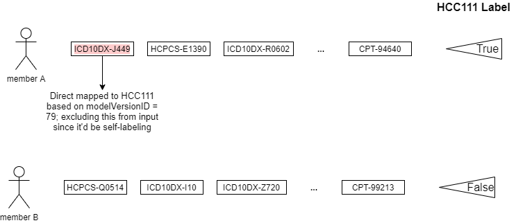
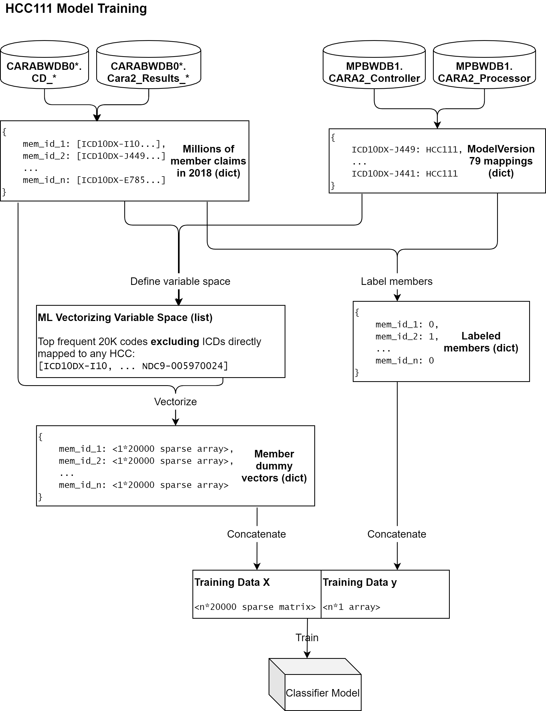
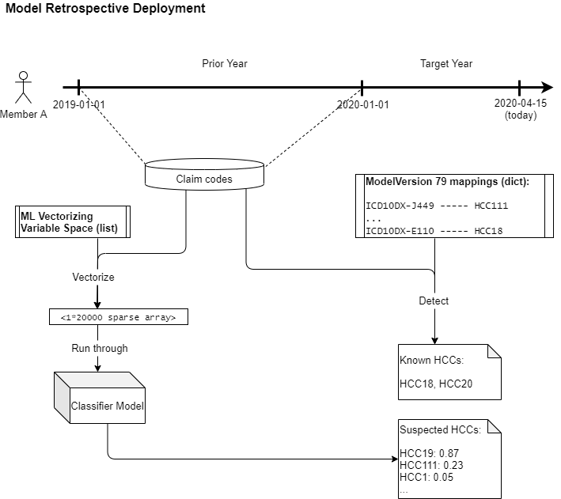
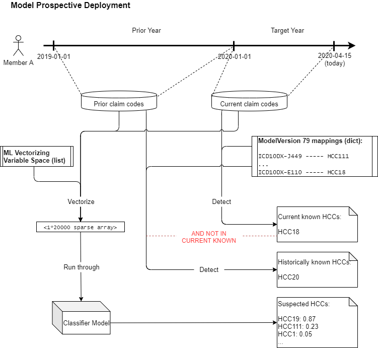
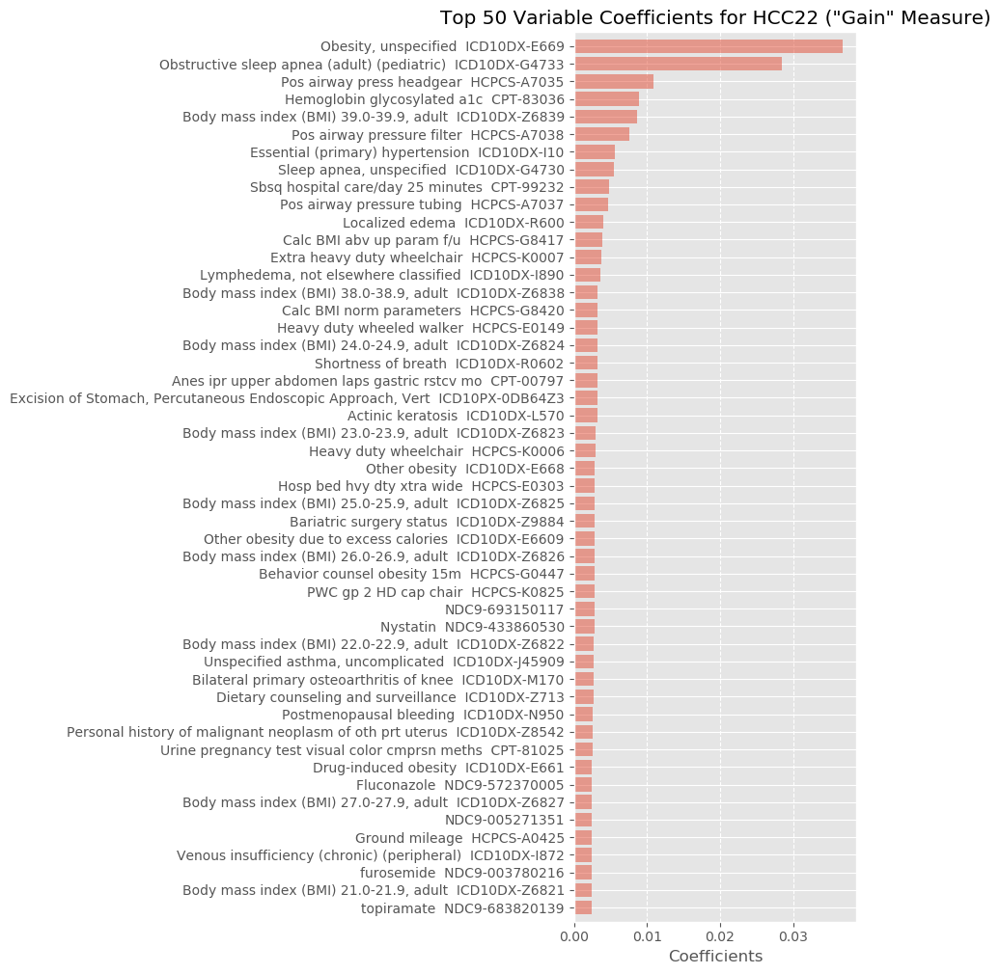
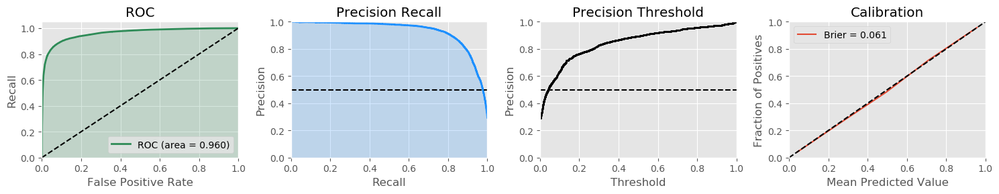
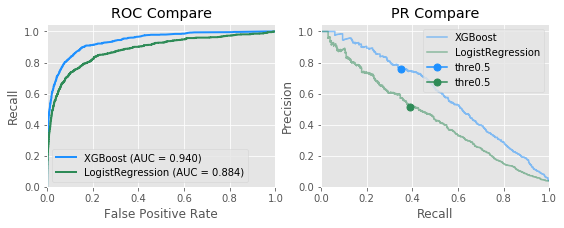
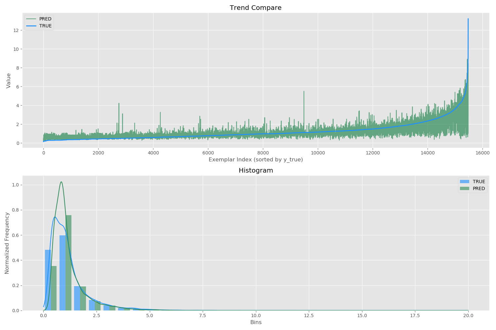

# shakespeare - Risk Gap Detection using  Medical Claims Based on Machine Learning

## Summary

**shakespeare** is a Python package for for detecting the known and likely conditions of a patient based on medical claim codes attached to that patient through the use of machine learning for risk adjustment purpose supported by [Inovalon Inc.](https://www.inovalon.com/) The package includes the entire pipelines for training and deploying, along with utilities for fetching data from Inovalon database. The models leverage wide range of medical claims, including all diagnoses and procedures as International Classification of Diseases (ICD) version 9/10 diagnosis/procedures, Current Procedural Terminology (CPT) and Healthcare Common Procedure Coding System (HCPCS), as well as medications as National Drug Code (NDC).

**shakespeare** provides stable Python APIs based on [XGBoost](https://xgboost.readthedocs.io/en/latest/index.html). Keep up to date with version releases and issue reporting by emailing to [ywang2@inovalon.com](ywang2@inovalon.com).

## Installation

The package depends on Python 3.4+. Before installing **shakespeare**, please install XGBoost first (highly recommend version 0.90) to avoid potential compile problems. Follow the [installation instruction](https://xgboost.readthedocs.io/en/latest/build.html) of offical guildline.

To download built **shakespeare** wheel files:

| Build Type      | Status | Artifacts |
| ---             | ---    | ---       |
| **Linux**   | []() | [Py3 wheel](https://github.com/fattyJake/shakespeare/releases/download/2.6.0/shakespeare-2.6.0-py3-none-manylinux1_x86_64.whl) |
| **Windows x64** | []() | [Py3 wheel](https://github.com/fattyJake/shakespeare/releases/download/2.6.0/shakespeare-2.6.0-py3-none-win_amd64.whl) |

#### Dependencies

```
gunicorn>=19.9.0
flask>=1.1.1
flask_swagger_ui==3.20.9
six>=1.12.0
pytz>=2018.9
python_dateutil>=2.7.3
kiwisolver>=1.0.1
pyparsing>=2.3.1
cycler>=0.10.0
scipy>=1.2.0
numpy>=1.16.1
pandas>=0.24.1
pyodbc>=4.0.25
matplotlib>=3.0.2
scikit-learn>=0.20.2
xgboost==0.90
shap==0.31.0
requests>=2.22.0
```

To install on Linux machine:

```
$ pip install shakespeare-2.6.0-py3-none-manylinux1_x86_64.whl
```

To install on Windows machine:

```
$ pip install shakespeare-2.6.0-py3-none-win_amd64.whl
```

Or install from source

```
$ python setup.py install
```

## Machine Learning Model

### Training

In order to generate training in a fast, easy way, we come up with an approach that only using patient claims data to train the model. Given one patient's claims codes in one service year, we find all ICD codes indicating certain HCC (directly mapped), label the patient with that HCC and using all other codes as input supporting evidences excluding directly mapped ICDs to train the model. Since each HCC (or other high level condition category) is independent to each other, we train one supervised binary classification model for each HCC individually. Take HCC111 (COPD) as example:

<p align="center">
  
</p>

The reason we don't use Sapphire chase results to label patients (which ideally produce real model ground truth) is that logic-wise the labeling process would be too complicated and hard to automate; on the other hand the current labeling approach is much easier in term of getting training data. In practice, the logic of training one HCC suspect targeting model is:

<p align="center">
  
</p>

### Deployment

Once we have the well-trained model, we should design the model deployment logic based on risk adjustment team's need for both retrospective and prospective purposes.

#### Retrospective

For retrospective targeting, the package accept a table of members' data with columns mem_id, provider_id (the pra_id who filed this claim), spec_id (the specialist ID of the provider), service_date (the encounter date of the claim), code_type (only accept "ICD10DX", "CPT", "HCPCS", "NDC9", "ICD10PX" or "DRG") and the code (claim code without decimal, e.g. I10) as input. It is also necessary to provide the target year as input as well. Retrospectively, the model screen the claim codes that are only filed prior to target year as input: in these codes, those directly mapped to certain HCCs indicates **"known"** conditions, and we use the rest of the codes as input to run through ML model to generate a 0-1 probability number for each HCC as the **"suspected"** conditions:

<p align="center">
  
</p>

#### Prospective

For prospective targeting, the package accept the same data input as retrospective. Prospectively, the model uses the claim codes that are filed in prior year and target year as input. For those codes filed in target year that are directly mapped to certain HCCs, we define these HCCs as **"known_current"** conditions; for those codes filed in prior year that are directly mapped to certain HCCs, we defined them as **"known_historical"**. Note that if known_historical = 1 **AND** known_current = 0, it means we are 100% certain the member should report those HCCs (similar to the concept of UCCC); and we use the rest of the codes (both prior and target year) as input to run through ML model to generate a 0-1 probability number for each HCC as the **"suspected"** conditions:

<p align="center">
  
</p>


## API Documentation

### 1. detect_internal

```python
shakespeare.detect_internal(
    payer: str,
    server: str,
    date_start: str,
    date_end: str,
    memberID_list: list = None,
    file_date_lmt: str = None,
    mem_date_start: str = None,
    mem_date_end: str = None,
    model: int = 79,
    sub_type_id: int = None,
    mode: str = 'b',
    auto_update: bool = False,
    threshold: float = 0,
    top_n_indicator: int = 5,
)
```

Wrapper of core_ml for Inovalon internal use.

##### Parameters
* ```payer``` : str. Name of payer database (e.g. 'CD_HEALTHFIRST')
* ```server``` : str. CARA server on which the payer is located ('CARABWDB03')
* ```date_start``` : str. String as 'YYYY-MM-DD' to get claims data from
* ```date_end``` : str. String as 'YYYY-MM-DD' to get claims data to
* ```memberID_list``` : list, optional (default: None). List of memberIDs (e.g. [1120565]); if None, get results from all members under payer
* ```file_date_lmt``` : str, optional (default: None). String as 'YYYY-MM-DD' indicating the latest file date limit of patient codes, generally at the half of one year
* ```mem_date_start``` : str, optional (default: None). As 'YYYY-MM-DD', starting date to filter memberIDs by dateInserted
* ```mem_date_end``` : str, optional (default: None). As 'YYYY-MM-DD', ending date to filter memberIDs by dateInserted
* ```model``` : int, optional (default: 63). An integer of model version ID in ```MPBWDB1.CARA2_Controller.dbo.ModelVersions```; note this package only support CDPS, CMS and HHS
* ```sub_type_id``` : int, optional (default: None). An integer of subTypeID that indicating Medicare member parts.
* ```mode``` : str, optional (default: "b"). One of 'r' for retrospective only, 'p' for prospective only and 'b' for both.
* ```auto_update``` : boolean, optional (default: False). If True, and no matching model pickled, it will call `update` function first
* ```threshold``` : float, optional (default: 0). A float between 0 and 1 for filtering output confidence above it
* ```top_n_indicator``` : int, optional (default: 5). How many indicators to output for each member each HCC
    
##### Return

```final_results```: dict.
```
{
    'retrospective': [
        {
            'mem_id': int,
            'gaps': [
                {
                    'condition_category': str,
                    'confidence': float,
                    'known': bool,
                    *['top_indicators': list,]
                    *['provider_id': list]
                }
            ]
        }
    ],
    'prospective': [
        {
            'mem_id': int,
            'gaps': [
                {
                    'condition_category': str,
                    'confidence': float,
                    'known_historical': bool,
                    'known_current': bool,
                    *['top_indicators': list,]
                    *['provider_id': list]
                }
            ]
        }
    ]
}
```

##### Examples
```python
>>> from shakespeare import detect_internal
>>> detect_internal(
        payer="CD_GATEWAY",
        server="CARABWDB06",
        date_start='2018-01-01',
        date_end='2019-04-15',
        threshold=0.5,
        top_n_indicator=5,
    )
```

```
    "prospective": [
        {
            "mem_id": 23023,
            "gaps": [
                {
                    "condition_category": "HCC55",
                    "confidence": 0.455976,
                    "known_current": 0,
                    "known_historical": 0,
                    "top_indicators": [
                        {
                            "code": "A0425",
                            "code_type": "HCPCS",
                            "provider_id": []
                        }
                    ]
                },
                ...
            ]
        },
        ...
    ],
    "retrospective": [
        {
            "mem_id": 23023,
            "gaps": [
                {
                    "condition_category": "HCC111",
                    "confidence": 0.107791,
                    "known": 1,
                    "top_indicators": [
                        {
                            "code": "J449",
                            "code_type": "ICD10DX",
                            "provider_id": [
                                505
                            ]
                        }
                    ]
                },
                ...
            ]
        },
        ...
    ]
```

### 2. detect_api

```python
shakespeare.detect_api(json_body: dict)
```

Wrapper of core_ml for external API use.

##### Parameters
* ```json_body``` : dict. The API body validated by Flask application, JSON structure details can be found in OpenAPI 3.0 documents.

##### Return

Same as that of ```detect_internal```.


### 3. core_ml

```python
shakespeare.core_ml(
    table: pandas.DataFrame,
    target_year: int,
    model: int = 79,
    sub_type_id: int = None,
    mode: str = 'b',
    auto_update: bool = False,
    threshold: float = 0,
    top_n_indicator: int = 5,
)
```

The core machine learning and logic pipeline, detects the HCCs a patient may have or already known along with supporting evidences.

##### Parameters
* ```table``` : pandas.DataFrame. A table with coulumn ```['mem_id', 'provider_id', 'spec_id', 'year', 'code']```
* ```target_year``` : int. Target service year
* ```model``` : int, optional (default: 63). An integer of model version ID in ```MPBWDB1.CARA2_Controller.dbo.ModelVersions```; note this package only support CDPS, CMS and HHS
* ```sub_type_id``` : int, optional (default: None). An integer of subTypeID that indicating Medicare member parts.
* ```mode``` : str, optional (default: "b"). One of 'r' for retrospective only, 'p' for prospective only and 'b' for both.
* ```auto_update``` : boolean, optional (default: False). If True, and no matching model pickled, it will call `update` function first
* ```threshold``` : float, optional (default: 0). A float between 0 and 1 for filtering output confidence above it
* ```top_n_indicator``` : int, optional (default: 5). How many indicators to output for each member each HCC

##### Return

Same as that of ```detect_internal```.


### 4. update

```python
shakespeare.update(model, year_of_service)
```

Since CARA use different ICD-HCC mappings at different service year, this function is for updating mappings, variable spaces and XGBoost models for all lines of business.

##### Parameters
* ```model``` : int. An integer of model version ID in ```MPBWDB1.CARA2_Controller.dbo.ModelVersions```; note this package only support CDPS, CMS and HHS
* ```sub_type_id``` : int, optional (default: None). An integer of subTypeID that indicating Medicare member parts.
* ```year_of_service``` : int. A intiger of the year of service for training data retrieval purpose

##### Examples
```python
>>> from shakespeare import update
>>> update(63, 2018)
```
```
############################## Training New Model 63 ##############################
Fetching training dateset...
Time elapase: 0:11:00.040693

Updating new mapping table...
Time elapase: 0:00:00.249601

Updating new variable spaces...
Time elapase: 0:00:12.090078

Updating new machine learning models...
Training HCC1
Training HCC10
...
Training HCC96
Training HCC99
Time elapase: 05:08:24.738294

############################ Finished Training Model 63 ###########################
```

### 5. delete

```
shakespeare.delete(model)
```

Main funtion for deleting old models to free up disk space.

##### Parameters

* ```model``` : int. An integer of model version ID in MPBWDB1.CARA2_Controller.dbo.ModelVersions; note this package only support CDPS, CMS and HHS

##### Examples
```python
>>> from shakespeare import delete
>>> delete(63)
```

### 6. fetch_db

This module contains tools for interactive with Inovalon CARA databases.

#### *function* batch_member_codes

```python
shakespeare.fetch_db.batch_member_codes(
    payer: str,
    server: str,
    date_start: str,
    date_end: str,
    memberID_list: list = None,
    file_date_lmt: str = None,
    mem_date_start: str = None,
    mem_date_end: str = None,
    model: int = 63,
    just_claims: bool = False,
)
```

Retrieve a list of members' claim codes.

##### Parameters

* ```payer``` : str. Name of payer database (e.g. 'CD_HEALTHFIRST')
* ```server``` : str. CARA server on which the payer is located ('CARABWDB03')
* ```date_start``` : str. String as 'YYYY-MM-DD' to get claims data from
* ```date_end``` : str. String as 'YYYY-MM-DD' to get claims data to
* ```memberID_list``` : list, optional (default: None). List of memberIDs (e.g. [1120565]); if None, get results from all members under payer
* ```file_date_lmt``` : str, optional (default: None). String as 'YYYY-MM-DD' indicating the latest file date limit of patient codes, generally at the half of one year
* ```mem_date_start``` : str, optional (default: None). As 'YYYY-MM-DD', starting date to filter memberIDs by dateInserted
* ```mem_date_end``` : str, optional (default: None). As 'YYYY-MM-DD', ending date to filter memberIDs by dateInserted
* ```model``` : int, optional (default: 63). An integer of model version ID in ```MPBWDB1.CARA2_Controller.dbo.ModelVersions```; note this package only support CDPS, CMS and HHS
* ```just_claims``` : bool, optional (default: False). If True, results will exclude MRR and RAPS returns


##### Return

* ```table``` : pandas.DataFrame. A table with coulumn ```['mem_id', 'provider_id', 'spec_id', 'year', 'code']```

##### Examples
```python
>>> from shakespeare.fetch_db import batch_member_codes
>>> df = batch_member_codes("CD_HEALTHFIRST", "CARABWDB03", "2019-01-01", "2019-12-31", memberID_list=[1120565])
>>> df.head()
```
```
    mem_id  provider_id  spec_id service_date            code
0  1120565          NaN      NaN   2019-01-28  NDC9-001680054
1  1120565          NaN      NaN   2019-01-28  NDC9-516721275
2  1120565          NaN      NaN   2019-01-28  NDC9-516721300
3  1120565          NaN      NaN   2019-01-29  NDC9-000540018
4  1120565          NaN      NaN   2019-01-29  NDC9-000544297
```

### 7. utils

This module contains tools for vectorizing and other data manipulating process.

#### *class* Vectorizer

```python
shakespeare.utils.Vectorizer(variables)
```

Rapidly build sparse dummy vector based on variable list order.

##### \_\_init\_\_ Parameters

* ```variables``` : list. Codes that are variables as "codetype-evidencecode"

##### \_\_call\_\_ Parameters

* ```y``` : iterable of iterables. Iterables of member variable lists.

##### \_\_call\_\_ Return

```member_vector```: csr_matrix. Sparse row vector of corresponding codes

##### Examples
```python
>>> from shakespeare.utils import Vectorizer
>>> vec = Vectorizer(['a', 'b', 'c'])
>>> vec([['a', 'b'], ['c']]).toarray()
```
```
array([[1, 1, 0],
       [0, 0, 1]])
```

#### *function* preprocess_table

```python
shakespeare.utils.preprocess_table(table, target_year)
```

Preprocess DataFrame of raw data: specialists filtering and divide table into prior period and current periord as form of grouped dictionary.

##### Parameters

* ```table``` : pandas.DataFrame. A table with coulumn ['mem_id', 'provider_id', 'spec_id', 'service_date', 'code']
* ```target_year``` : int. Target service year


##### Return

* ```dict_prior``` : ```{mem_id: {"code": [], "provider_id": []}}```
* ```dict_current``` : ```{mem_id: {"code": [], "provider_id": []}}```


#### *function* run_ml

```python
shakespeare.utils.run_ml(ensemble: dict, MEMBER_LIST: list, vector: csr_matrix)
```

ML process and post-processing.

##### Parameters

* ```ensemble``` : dict. ML condition_category classifier dict  
* ```MEMBER_LIST``` : list. Fixed order of member ID list
* ```vector``` : scipy.sparse.csr_matrix. ML input sparse matrix

##### Return

* ```df_condition``` : pd.DataFrame. Table with column ```['mem_id', 'condition_category', 'confidence', *['known'], *[,'known_current', 'known_historical']]```


#### *function* get_indicators

```python
shakespeare.utils.get_indicators(
    ensemble: dict,
    MEMBER_LIST: list,
    condition: pandas.DataFrame,
    vector: csr_matrix,
    top_n_indicator: int,
    dict_prior: dict,
    dict_current: dict,
    mappings: dict,
    variables: list,
)
```

ML process and post-processing.

##### Parameters

* ```ensemble``` : dict. ML HCC classifier dict
* ```MEMBER_LIST``` : list. Fixed order of member ID list
* ```condition``` : pandas.DataFrame. Table with column ```['mem_id', 'condition_category', 'confidence', *['known'], *[,'known_current', 'known_historical']]```
* ```vector``` : scipy.sparse.csr_matrix. ML input sparse matrix
* ```top_n_indicator``` : int. How many indicators to output for each member each HCC
* ```dict_prior``` : dict. Prior codes and pra_ids from `preprocess_table`
* ```dict_current``` : dict. Current codes and pra_ids from `preprocess_table`
* ```mappings``` : dict. Mappings from ICDs to HCCs
* ```variables``` : list. ML variables space

##### Return

* ```results``` : list
```
[
    {
        'mem_id': int,
        'gaps': [
            {
                'condition_category': str,
                'confidence': float,
                'known': bool,
                *['uccc': bool,]
                'top_indicators': list,
                'provider_id': list
            }
        ]
    }
]
```


### 8. visualization

This module contains tools for plot classification model performance.

#### *function* plot_coefficients

```python
shakespeare.visualizations.plot_coefficients(
    model,
    variables,
    name,
    shap_mode=False,
    shap_set=None,
    n=50,
    bottom=False,
    save_name=None
)
```

##### Parameters

* ```model``` : Scikit-Learn API like model or CalibratedClassifierCV.
* ```variables``` : list. Variable space to map plot axis
* ```name``` : str. HCC name of the coefficient
* ```shap_mode``` : boolean, option (default: False). If True, must provide shap_set and the function will calculate mean absolute SHAP values as coefficients.
* ```shap_set``` : numpy 2D array, optional (default: None). The input X matrix to calculate SHAP value.
* ```n``` : int, optional (default: 50). Returns top/bottom n variables
* ```bottom``` : boolean, optional (default: False). Returns bottom n variables
* ```save_name``` : str, optional (default: None). The path of output image; if provided, save the plot to disk

##### Returns

Bar plot with feature importance of the model.

##### Examples
```python
>>> from shakespeare.visualizations import plot_coefficients
>>> from xgboost import XGBClassifier
>>> xgb = XGBClassifier().fit(X_train, y_train)
>>> plot_coefficients(xgb, variables, name='HCC22', n=100)
```
<p align="center">
  
</p>

#### *function* plot_performance

```python
enid.visualizations.plot_performance(out_true, out_pred, save_name=None)
```

##### Parameters
* ```out_true``` : list or 1-D array. List of output booleans indicating if True
* ```out_pred``` : list or 1-D array. List of probabilities
* ```save_name``` : str, optional (default: None). The path of output image; if provided, save the plot to disk

##### Returns
1. **ROC (Receiver Operating Characteristic) Curve**: A curve used to define a model’s ability to separate patients who encounter unplanned readmission or adverse events from patients who do not. A model with perfect prediction would have and area of 1.0 under the curve. This is usually the best metric for a machine/deep learning classifier’s relative performance.
2. **Precision-Recall Curve**: This metric depicts the precision vs. recall trade-off. Precision can be translated as ‘percent of the time the model is correct.’ Recall is the total percent of true positives detected, starting from the most probable down to least probable as evaluated by the model. A perfect prediction algorithm has an area of 1.0. This is great for describing the ranking ability of a model.
3. **Precision-Threshold Curve**: This curve helps you choose a threshold when deciding where to operate on your precision recall curve if you are using a threshold.
4. **Calibration Curve**: We want probability values that come out of a deep learning algorithm to properly match up with actual probabilities (e.g. a 0.5 confidence should be right 50% of the time, not 80% of the time). This curve demonstrates that.

##### Examples
```python
>>> from shakespeare.visualizations import plot_performance
>>> y_true = [0, 1, ... 1, 0]
>>> y_prob = [0.0000342, 0.99999974, ... 0.84367323, 0.5400342]
>>> plot_performance(y_true, y_prob, "HCC19.png")
```
<p align="center">
  
</p>

#### *function* plot_comparison

```python
shakespeare.visualizations.plot_comparison(
    y_true, y_score_1, y_score_2, name_1, name_2, thre=0.5, save_name=None
)
```

##### Parameters
* ```y_true``` : list or 1-D array. List of output booleans indicating if True
* ```y_score_1``` : list or 1-D array. List of probabilities of model 1
* ```y_score_2``` : list or 1-D array. List of probabilities of model 2
* ```name_1``` : str. Name of model 1
* ```name_2``` : str. Name of model 2
* ```thre``` : float, optional (default: 0.5). Threshold for point marker on the curves
* ```save_name``` : str, optional (default: None). The path of output image; if provided, save the plot to disk

##### Examples
```python
>>> from shakespeare.visualizations import plot_comparison
>>> y_true = [0, 1, ... 1, 0]
>>> y_prob_1 = [0.0000342, 0.99999974, ... 0.84367323, 0.5400342]
>>> y_prob_2 = [0.0000093, 0.99999742, ... 0.99999618, 0.2400342]
>>> plot_comparison(y_true, y_prob_1, y_prob_2, XGBoost', 'LogisticRegression')
```

<p align="center">
  
</p>

#### *function* plot_numerics

```python
shakespeare.visualizations.plot_numerics(out_true, out_pred, log=False, save_name=None)
```

##### Parameters
* ```out_true``` : list or 1-D array. List of ground truth y
* ```out_pred``` : list or 1-D array. List of y-hat
* ```log``` : boolean, optional (default: False). If True, tranform y-axis as logged for visualization purpose
* ```save_name``` : str, optional (default: None). The path of output image; if provided, save the plot to disk

##### Examples
```python
>>> from shakespeare.visualizations import plot_numerics
>>> y_true = [1, 2, 3, 4]
>>> y_prob = [0.9, 2.2, 2.5, 4.1]
>>> plot_numerics(y_true, y_prob, log=True)
```

<p align="center">
  
</p>

## For more information

*   [Inovalon Website](https://www.inovalon.com/)
*   [Inovalon AI Solutions](https://www.inovalon.com/solutions/payers/artificial-intelligence/)

## License

[GPL License 3.0](LICENSE)
